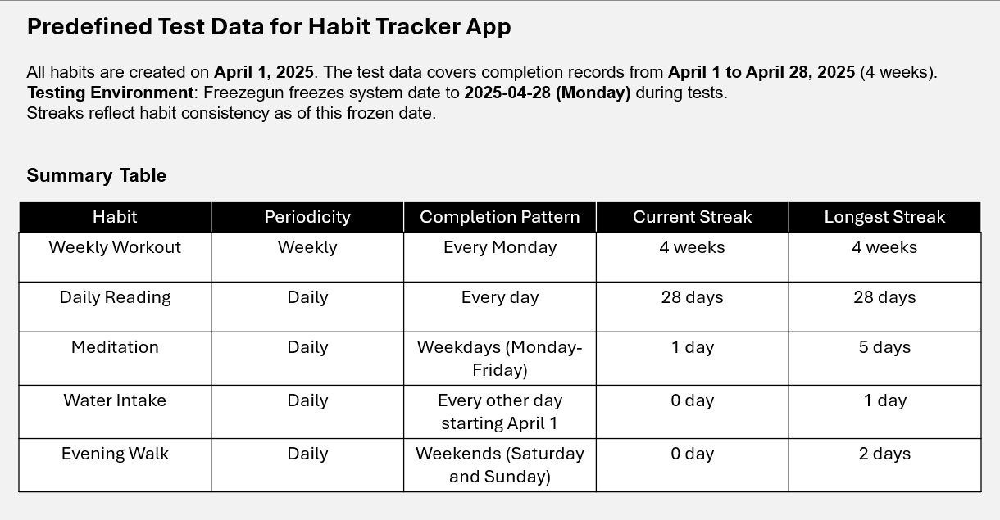

# Habit Tracker Application
## IU International University of Applied Sciences (DLBDSOOFPP01)

Python backend-focused habit tracking application with graphical user interface, implementing object-oriented and functional programming concepts.

## Features
- Create, track, and analyze daily/weekly habits
- Predefined test data for demonstration
- Simple graphical user interface
- Motivational quotes system
- Habit analytics and streak tracking
- Data persistence using JSON storage

## System Overview
### User Flow Diagram


### Class Diagram


## Prerequisites
- **Python 3.7 or higher**  
  *(Verify with `python --version` or `python3 --version`)*
- **pip** (Python package manager)  
  *([Installation guide](https://pip.pypa.io/en/stable/installation/) if missing)*

## Installation
1. Clone the repository:
   ```bash
   git clone https://github.com/Adevferjani/Habit-tracker-iu.git
2. Navigate to project directory:
   ```bash
   cd Habit-tracker-iu
3. Install dependencies:
   ```bash
   pip install -r requirements.txt
## Launching the Application
   ```bash
   python gui.py
   ```
Expected Initial Interface:


## Usage guide
Please refer to the user flow diagram above to guide you.

## Testing the Application
the test suite verifies core functionality using pytest:
1. Install testing framework:
   ```bash
   pip install pytest
2. Execute tests:
   ```bash
   pytest test_habit_tracker.py -v
The following is a summary of the test fixture used by the testing module


## License
[MIT License](LICENSE) - See repository for details
